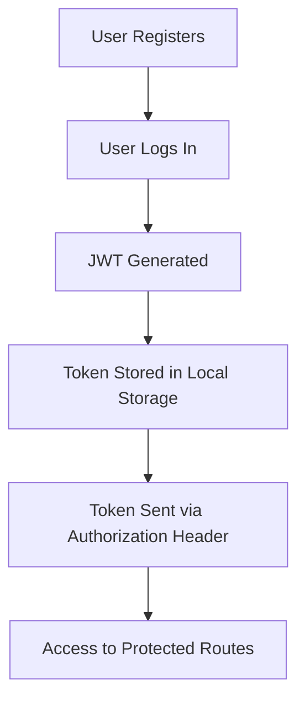
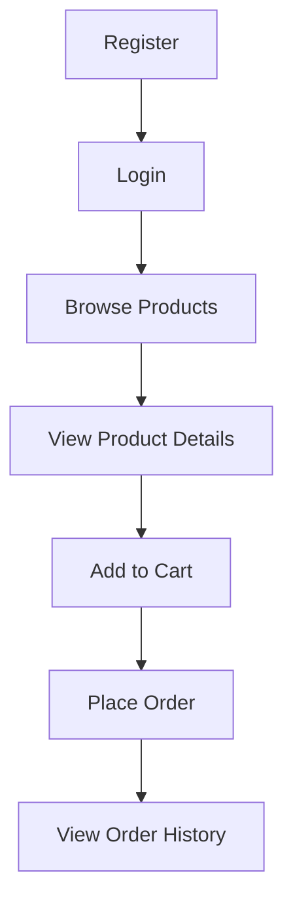
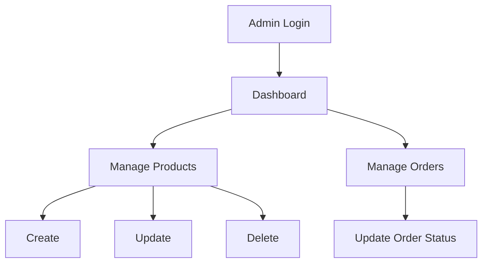

<div align="center">

# 🛒 MERN E-Commerce Platform

**A full-stack e-commerce application built with MongoDB, Express.js, React.js, and Node.js**

Secure authentication · Role-based authorization · Product management · Cart & order processing

[](https://nodejs.org/)
[](https://expressjs.com/)
[](https://reactjs.org/)
[](https://www.mongodb.com/)
[](https://jwt.io/)

</div>

---

## 📖 Overview

This project is a complete **MERN Stack e-commerce platform** featuring two distinct experiences: a **Customer panel** for browsing and purchasing products, and an **Admin panel** for managing inventory and orders. It was built to demonstrate end-to-end full-stack development — from secure authentication and role-based access control to RESTful API design and React-based frontend integration.

---

## ✨ Features

<table>
<tr>
<td valign="top" width="50%">

### 👤 Customer

- 📝 User registration
- 🔐 Secure JWT-based login
- 🛍️ Browse all products
- 🔍 View detailed product information
- 🛒 Add products to cart
- ❌ Remove products from cart
- 📦 Place orders
- 📜 View order history

</td>
<td valign="top" width="50%">

### 👨‍💼 Admin

- 🔐 Admin login
- ➕ Create new products
- ✏️ Update existing products
- 🗑️ Delete products
- 📋 View all customer orders
- 🔄 Update order status

</td>
</tr>
</table>

---

## 🛠️ Tech Stack

| Layer | Technologies |
|---|---|
| **Frontend** | React.js, React Router DOM, Axios |
| **Backend** | Node.js, Express.js |
| **Database** | MongoDB, Mongoose |
| **Authentication & Security** | JWT (JSON Web Token), bcrypt.js |

---

## 📂 Project Structure

```text
ecommerce-platform/
│
├── config/
│   └── db.js                   # MongoDB connection setup
│
├── controllers/
│   ├── authController.js       # Registration & login logic
│   ├── productController.js    # Product CRUD logic
│   ├── cartController.js       # Cart management logic
│   └── orderController.js      # Order placement & tracking
│
├── middleware/
│   ├── protect.js              # JWT verification middleware
│   └── admin.js                # Admin-only route guard
│
├── models/
│   ├── User.js
│   ├── Product.js
│   ├── Cart.js
│   └── Order.js
│
├── routes/
│   ├── authRoutes.js
│   ├── productRoutes.js
│   ├── cartRoutes.js
│   └── orderRoutes.js
│
├── frontend/
│   └── src/
│       ├── components/
│       ├── pages/
│       ├── services/
│       ├── App.jsx
│       └── main.jsx
│
├── server.js
├── package.json
├── .env
└── README.md
```

---

## 🔐 Authentication Flow



---

## 🛍️ Customer Workflow



---

## 👨‍💼 Admin Workflow



---

## 🌐 API Endpoints

### Authentication

| Method | Endpoint | Description |
|---|---|---|
| `POST` | `/api/auth/register` | Register a new user |
| `POST` | `/api/auth/login` | Authenticate a user and return a JWT |

### Products

| Method | Endpoint | Description |
|---|---|---|
| `GET` | `/api/products` | Get all products |
| `GET` | `/api/products/:id` | Get a single product by ID |
| `POST` | `/api/products` | Create a new product *(admin only)* |
| `PUT` | `/api/products/:id` | Update a product *(admin only)* |
| `DELETE` | `/api/products/:id` | Delete a product *(admin only)* |

### Cart

| Method | Endpoint | Description |
|---|---|---|
| `GET` | `/api/cart` | Get the current user's cart |
| `POST` | `/api/cart` | Add a product to the cart |
| `DELETE` | `/api/cart/:productId` | Remove a product from the cart |

### Orders

| Method | Endpoint | Description |
|---|---|---|
| `POST` | `/api/orders` | Place a new order |
| `GET` | `/api/orders` | Get order history |
| `PUT` | `/api/orders/:id` | Update order status *(admin only)* |

---

## ⚙️ Getting Started

### Prerequisites

- [Node.js](https://nodejs.org/) installed
- A [MongoDB](https://www.mongodb.com/) connection string (local or Atlas)

### 1. Clone the repository

```bash
git clone https://github.com/Jeevan9898/ecommerce-platform.git
cd ecommerce-platform
```

### 2. Backend setup

```bash
npm install
npm run dev
```

### 3. Frontend setup

```bash
cd frontend
npm install
npm run dev
```

---

## 🔑 Environment Variables

Create a `.env` file in the project root with the following keys:

```env
MONGO_URI=your_mongodb_connection_string
JWT_SECRET=your_jwt_secret
PORT=5005
```

---

## 📚 Concepts Implemented

<table>
<tr>
<td valign="top" width="50%">

### Backend

- REST API development
- MVC architecture
- Express routing
- Custom middleware
- JWT authentication
- Password hashing (bcrypt)
- Role-based authorization
- CRUD operations
- MongoDB relationships
- Mongoose `populate()`
- Environment variables

</td>
<td valign="top" width="50%">

### Frontend

- React components
- React Router
- `useState` / `useEffect`
- `useNavigate` / `useParams`
- Axios API integration
- Form handling
- Conditional rendering
- Local storage
- React state management

</td>
</tr>
</table>

---

## 📸 Screenshots

> Add screenshots of the following pages here:

| Page | Preview |
|---|---|
| Home Page | _add screenshot_ |
| Login Page | _add screenshot_ |
| Register Page | _add screenshot_ |
| Product Details | _add screenshot_ |
| Shopping Cart | _add screenshot_ |
| Orders | _add screenshot_ |
| Admin Dashboard | _add screenshot_ |

---

## 🚀 Future Improvements

- [ ] Product search
- [ ] Product filtering
- [ ] Wishlist functionality
- [ ] Payment gateway integration
- [ ] Product reviews & ratings
- [ ] Image upload via Cloudinary
- [ ] Fully responsive UI
- [ ] Email notifications

---

## 🎯 Learning Outcomes

This project demonstrates the development of a complete MERN stack application featuring secure authentication, role-based authorization, CRUD operations, frontend-backend integration, shopping cart management, and order processing. It was built as a learning project to understand the full workflow of modern full-stack web development.

---

## 👨‍💻 Author

**Jeevan Yadav**

[](https://github.com/Jeevan9898)
[](https://www.linkedin.com/in/jeevan-yadav-b664952b5)

---

<div align="center">

⭐ If you found this project helpful, consider giving it a star on GitHub!

</div>
